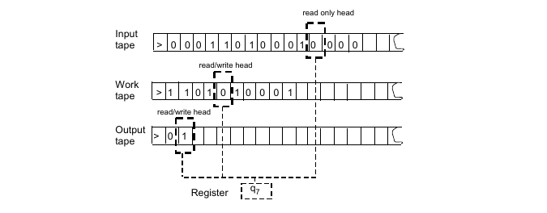

# The computational model of complexity

We usually care about functions whose inputs and outptus are n-bit strings.
The n-bit string can be a representation of any object using a binary
encoding mechanism.

- Integer -> n-bit string
- (Integer,Integer) -> (n-bit string,#,n-bit string) -> s1#s2 (# : concatanation)
- Integer List -> s1#s2#...#sk (# is equivalent to a separation symbol)
- Matrices -> (Integer List) List 

And so on, there are proofs that any object has a unique encoding.

## Decision Problems, Languages 

Let's denote the set of **Boolean functions** whose outputs are 1-bits {0,1}
then the set is called a *language*.

A Language is a set of boolean functions that output 1 or 0 depending on theinput, we also refer to them as *decision problems*.

## Turing Model

A Turing machine or a k-tape Turing machine is a computational model for 
representing algorithms.

A turing machine is represented by an *alphabet of symbols*, *k-tapes* where the first tape is a **read only tape** that contains the input,
the k-tape is a write tape where the machine writes the output.
The (k-1) remaining tapes represent the scratch-pad where we write 
intermediate values.

At each state the machine has a state value *Q* held in a *register*.
The state value *determines* the machine next step.

The formalism of a turing machine is : T(G,S,Q)

- G designates the alphabet (o for blank,> for start, 1 and 0)
- S designates the transition function defined as T: Q x G -> Action
- Q designates the finite set of states of the machine.

Action represents a function that can execute a move (left or right) and
a function over the tape cell contents.

## Computing functions

Let f : {0,1}n -> {0,1}n and let T : N -> N, let M be a *turing machine*.

We say that *M computes f in T(n)-time* if for every n-bit string,
if when M is initialized with (x) after T(|x|)-steps M halts and 
the output tape contains f(x).

- T usually denotes the big-oh bound for the computation.
- T is a function of the input length (|x| = len(x)).
- We usually want a complexity *relative* to inputs size.

Let PAL : {0,1}n -> {0,1} is a function defined for n-bit strings
such as PAL(x) = 1 if x is a palindrome, 0 otherwise.

Let's build a TM to compute PAL.

- Our Alphabet : {>,o,0,1} 

1. Copy the input to the read/write work tape : this is T(|n|)
2. Move the input head to the begining.
3. Move the work head to the end.
4. Move the input head to the right by 1 step
5. Move the work head to the left by 1 step
6. Compare the values if they're different write 0 and halt.
7. If input head is at end and work head is at beginning write 1 and halt.

